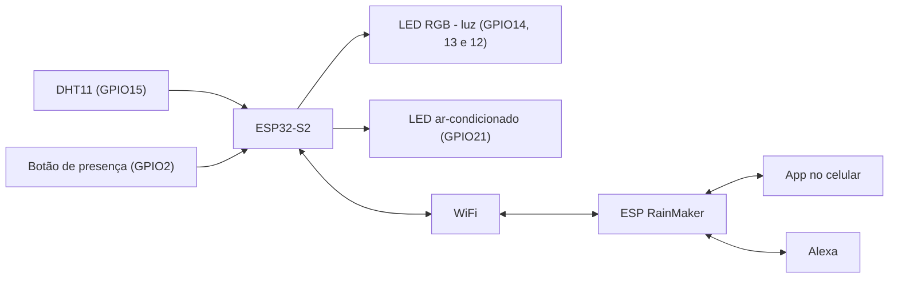

# Casa Inteligente - Projeto Final Modulo IV

Sistema de casa inteligente feito na Franzininho WiFi LAB01 (ESP32-S2) com ESP-IDF e ESP RainMaker. Recursos:

- Controle do acionamento, intensidade de brilho e cor do LED RGB do LAB01 pelo app ESP RainMaker. 
- Criação de horários automáticos e monitoramento de temparatura, umidade e luminosidade da casa. 
- Ar-condicionado simulado por LED acionado automaticamente em temperaturas acima do limite estabelecido.
- Botão que simula sensor de presença e acionamento da luz. 

## Diagrama de blocos



## O que precisa

- ESP-IDF v5.x

- o repositório do ESP RainMaker clonado ao lado do projeto:
  
  ```
  cd ~/Install/esp
  git clone --recursive https://github.com/espressif/esp-rainmaker.git
  ```

- o app **ESP RainMaker** no celular (Android ou iPhone)

## Como compilar e gravar

```
idf.py set-target esp32s2
idf.py build
idf.py -p /dev/ttyACM0 erase-flash flash
idf.py -p /dev/ttyACM1 monitor
```

Para gravar: segurar BOOT, apertar RESET, soltar BOOT. Depois de gravar, apertar RESET.

## Como configurar

1. Com o monitor aberto, a placa mostra um QR code.
2. No app ESP RainMaker, criar a conta, tocar em **Add Device** e ler o QR code.
3. Escolher a rede WiFi e digitar a senha.
4. Os dispositivos **Luz**, **Ambiente** e **Ar-condicionado** aparecem no app.

Para trocar de rede: segurar o botao BOOT por 3 segundos.

## Como usar

- **Luz:** liga/desliga, brilho e cor pelo app.
- **Horarios:** no app, aba **Schedules**, criar um horário para ligar ou desligar a luz.
- **Ambiente:** mostra a temperatura e a umidade (atualiza a cada 30 s).
- **Ar-condicionado:** com **Automatico** ligado, liga acima de 28 graus e desliga abaixo de 27. Também pode ser acionado pelo app. 
- **Presenca:** pressionar o botão do GPIO2 para acender a luz. Ela apaga depois de 30 s sem apertar de novo.
- **Alexa:** no app da Alexa, ativar a skill **ESP RainMaker** e entrar com a mesma conta. Depois: "Alexa, ligar luz", "Alexa, luz azul", "Alexa, luz em 50 por cento".

## Exemplos de funcionamento

(colocar aqui as fotos e prints)

## Arquivos

- `main/main.c`: programa principal (dispositivos do RainMaker, ar automatico e presenca)
- `components/luz`: LED RGB (converte a cor do app para RGB)
- `components/sensores`: DHT11
- `components/dht`: driver usado no curso
